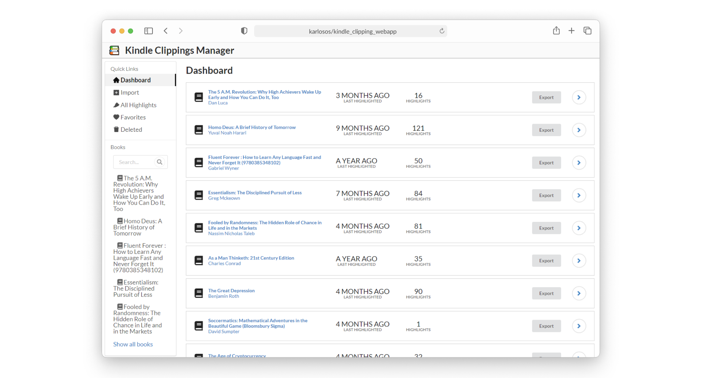

***

<h4 align="center">Kindle Clippings Manager</h4>

  <a href="#about">About</a> •
  <a href="#what-i-have-learned">What I Have Learned</a> •
  <a href="#development">Development</a> •
  <a href="#deployment">Deployment</a>

<table>
<tbody>
<td align="center">
 
Website: <b><a href="https://karlosos.github.io/url_to_bibtex/">karlosos.github.io/url_to_bibtex 🌐</a></b> 

</td>
</tbody>
</table>

## About

Import Kindle Clippings and show them in accessible way. The app divides clippings into books and gives an option to delete and like highlights.

## What I Have Learned

This project was more goal oriented rather than education oriented. I wanted to have a simple desktop application (electron) for managing my kindle clippings.

## Development

1. Install dependencies with `npm install`.
1. Run desktop application with `npm run start` or react app with `npm run react-start`.
1. Access application under `localhost:3000`.

## Deployment
